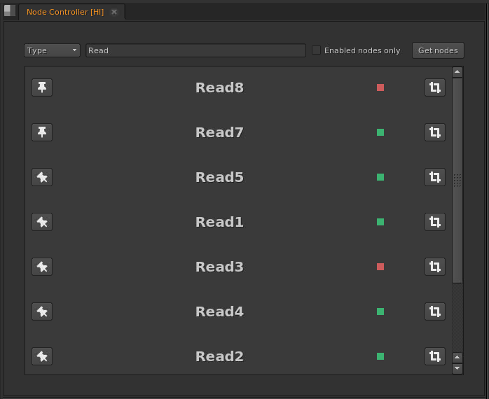
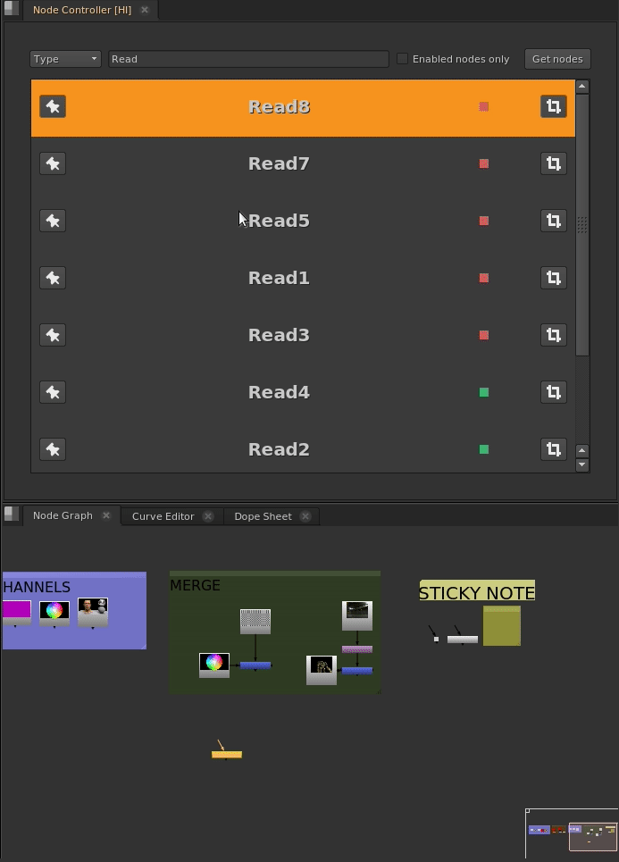
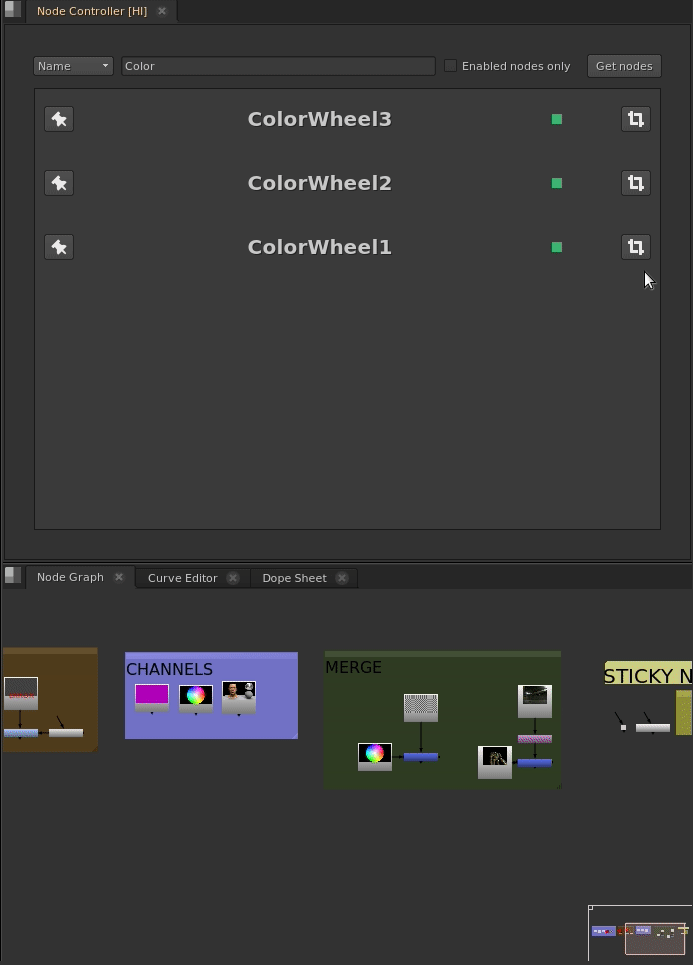
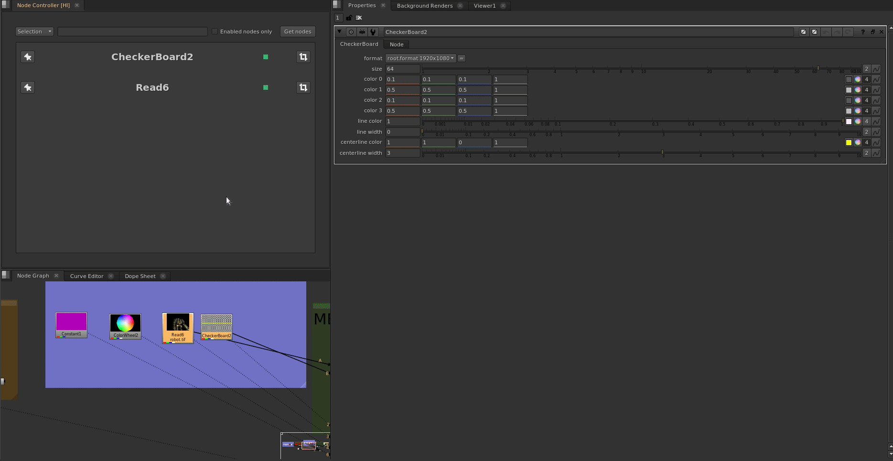
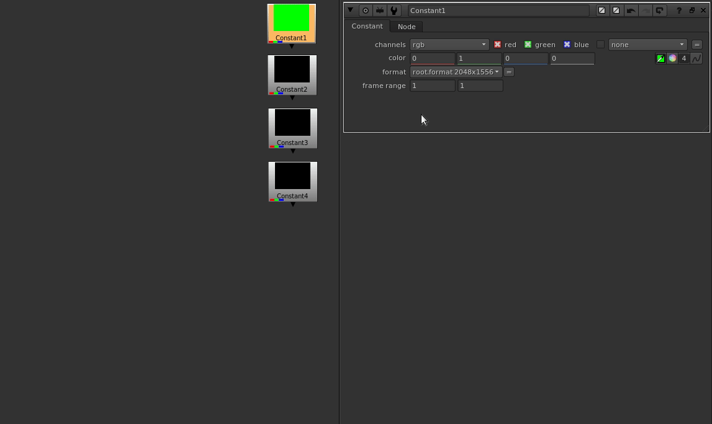

# hinuke
Tools for the Foundry's Nuke
### How to Install ###
1. git clone https://github.com/ireneher/hinuke.git
2. cd hinuke
3. source setup.sh

This method works per session. If desired, modify ~/.bashrc to permanently append to path.

## Tools ##
### Node Controller ###
Custom panel that acts as a global Nodegraph manager. Core idea inspired by [Julius Ihle's Katana Interactive RenderPanel](http://julius-ihle.de/?p=2554).

Features:
* **Query** and retrieve (by Name, Type, or Selection) with the option to filter out disabled nodes.
* **View** selected node, via number key.
* **Display** properties by double clicking.
* **Frame** node, meaning zoom into it in the nodegraph.
* **Pin**/Unpin selected in current list, to curate panel.
* **Disable**/Enable panel selection in nodegraph.
* **Rename** nodes in panel selection (two modes: replace or absolute).

### Knob Share ###
Properties menu tool to edit knobs in batch. The value is propagated from the current node to others of the same type, according to user selection.

Here is a very simple example where the _colour_ knob is shared from _Constant1_ to all other _Constant_ nodes except _Constant4_.

